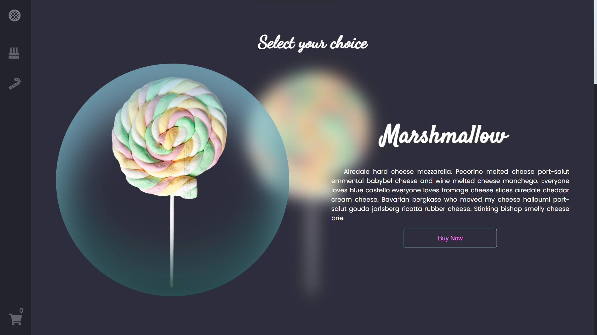

<!-- PROJECT LOGO -->
 

<!--    -->

<h3 align="center">Sweet Boutique</h3>

  

    A Front End Design of an E Commerce Website - Sweet Centered Website
     

  

<!-- TABLE OF CONTENTS -->

  
Table of Contents

  <ol>
    <li>
      <a href="#about-the-project">About The Project</a>
      <ul>
        <li><a href="#built-with">Built With</a></li>
      </ul>
    </li>
    <li>
      <a href="#website">Website</a>
      <ul>
        <a href="https://sweet-boutique.netlify.app/">https://sweet-boutique.netlify.app/</a>
      </ul>
    </li>
    <li>
      <a href="#contact">Contact</a>
    </li>
  </ol>

<!-- ABOUT THE PROJECT -->
## About The Project

Sweet Boutique is an online sweets shop. This is a frontend prototype of the website with subtle animations and transitions
 

### Built With

* [Javascript](https://www.javascript.com/)

 

<!-- GETTING STARTED -->
## Website

Link: <a href="https://sweet-boutique.netlify.app/">https://sweet-boutique.netlify.app/</a>

 

<!-- CONTACT -->
## Contact

Jan Mikko Malizon - [@jnmkkmlzn](https://twitter.com/jnmkkmlzn) - malizonjanmikko@gmail.com

Sweet Boutique: [https://github.com/jmmalizon/sweet-boutique](https://github.com/jmmalizon/sweet-boutique)

(<a href="#top">back to top</a>)

